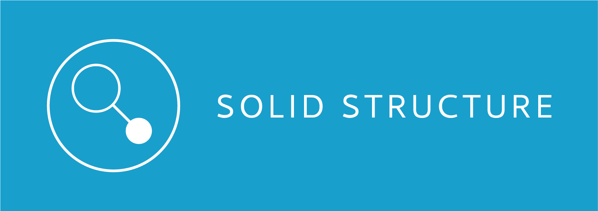
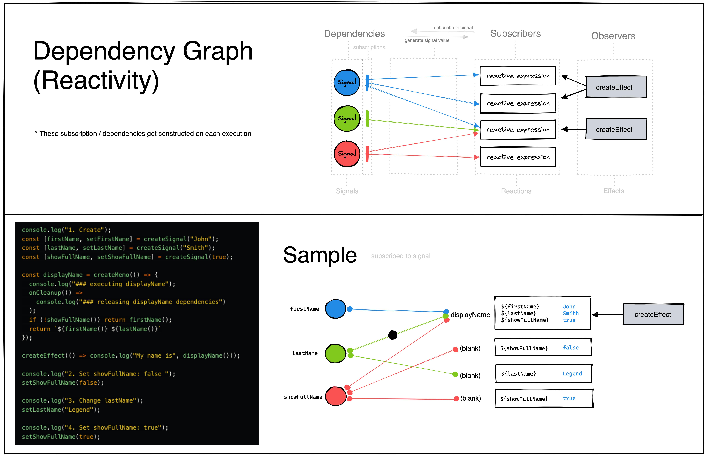

# Solid Structure
Solid Structure is a Chrome Extension DevTool for [SolidJS](https://www.solidjs.com/) application.

Solid Structure allows developer to oversee a list of signal connections, signal updates, and visualize structural & dependency graphs of an inspected application.
<br></br>

## Features
<p align="center">
  
  <br></br>
  
</p>
<br/>

### Current Features
- [x] Signal Tracker (Signal List)
- [x] Signal Update Logs (on/off)
- [x] Signal Visualizations
    - [x] Structural Graph
    - [x] Dependency Graph
    - [x] Box Orientation Adjustment
- [x] Dark Mode
<br></br>

### Area of Improvement
- Signal Flow: Unidrectional to Bidirectional
   - Current loading methodology of signal information from a SolidJS application to the tool's Signal Tracker is unidirectional. All of application's signal information is lively updated to the Signal Tracker upon signal changes in the application, but its signals cannot be modified from the developer tool. Modifying the tool's root data access method to allow developer to change application signals directly from the tool would be very useful in debugging process and could eventually lead to time travel debugging through the log records in the Log Monitor section as well. 
- Establishing Connection Between Structural Graph & Dependency Graph
   - Currently, the tool only allows to see dependency graph of selected signals from the Signal Tracker, which is "signal → component" relationship. In order to see a dependency graph of signals for a selected component from a Structural Graph ("component → signal" relationship), the two graphs data needs be connected
- More Information on Graph Nodes
   - Current nodes on each graph only show names for what it represents: signal or component name. Displaying more detailed information on hover of each graph node would provide better context in the debugging process. 
- Visual Indicator On Graphs
   - Including visual indicator to help identify where in both structural and dependency graph the signal is being updated would make interpreation of graphs much easier for developers.


## Details
### Inspector Section
The Inspector section is composed of three main features: <b>Signal Tracker</b>, <b>Structural Graph</b>, and <b>Dependency Graph</b>. 

- <b>Signal Tracker</b> lists out all the signal information of a running SolidJS application: <b>name</b>, <b>reference id</b>, <b>type</b>, and <b>value</b>. Each state (value) of a signal is lively updated upon signal changes in a SolidJS application. Clicking the name of each signal displays its <b>Dependency Graph</b>.

- <b>Dependency Graph</b> is a visualization of reactivity in a SolidJS application. It helps to identify and visualize where the selected signal is being invoked at a component level. It currently only shows "signal → component" relationship, but it should also show "component → signal" relationship when the component is selected from the <b>Structural Graph</b> in our future updates. 
<p align="center">
  
  <br/>
</p>

- <b>Structural Graph</b> is a component tree that displays the architecture of the application to help developer visualize how the application is structured. In our future updates, each node of the graph will show more detailed information about the selected component on hover.
<br></br>

### Graph Section
The Graph section displays a structural and dependency graphs without the signal list to provide a better view of the graphs on a smaller screen. The orientation of these graph boxes could be altered by the icons at the top right corner - to be either veritcal (default) or horizontal. This section will become much more useful once each node could display more detailed information about the component or signal. 
<br></br>

### Log Monitor
The Log Monitor section keeps track of and logs signal changes in a SolidJS application. Developer could reset the logs to clean out the previous logs and have control over the log status with the record switch at the top left corner to either prevent having too much logs or to keep track of signal changes for specific actions when testing.
<br></br>

## Getting Started
### Installation
1. Clone the repo
   ```sh
   git clone https://github.com/oslabs-beta/Solid-Structure.git
   ```
2. Install NPM packages
   ```sh
   npm install
   ```
3. Run development environment (HMR with CRX)
   ```sh
   npm run dev
   ```
3. Check for creation of "dist" folder at the root directory

4. Go to "Manage Extension" at Chrome Browser

5. Upload "dist" folder 
<br></br>

### Checking Connection
Run a sample SolidJS application from a separate terminal
   ```sh
   npm run demoapp
   ```
<br/>

## Built With
* Solid.JS
* TypeScript
* SCSS
* D3.JS
* Vite (CRX)
* Chrome API DevTool
<br></br>

## Contributing
Contributions are what make the open source community such an amazing place to learn, inspire, and create. Any contributions you make are **greatly appreciated**.

1. Fork the Project
2. Create your Feature Branch (`git checkout -b feature/NewFeature`)
3. Commit your Changes (`git commit -m 'Add some NewFeature'`)
4. Push to the Branch (`git push origin feature/NewFeature`)
5. Open a Pull Request
<br></br>

## Basic Rules
* All types are managed in **types.ts** file
* Overall color-scheme and basic stylings are controlled in **main.scss** file
<br></br>

<!-- LICENSE -->
## License
Distributed under the MIT License. See `LICENSE.txt` for more information.
<br></br>

## Authors
* Matthew Yeon [@myeon7](https://github.com/myeon7)
* Brandon Brighi [@Bbrighi2](https://github.com/Bbrighi2)
* Tanner Lyon [@THLyon](https://github.com/THLyon)
* Mark Yermolov [@yermie123](https://github.com/yermie123)
<br></br>

## Acknowledgements
* [thetarnav/solid-devtools](https://github.com/thetarnav/solid-devtools)
* [CM-Tech/solid-debugger](https://github.com/CM-Tech/solid-debugger)
* [Best README Template](https://github.com/othneildrew/Best-README-Template)
